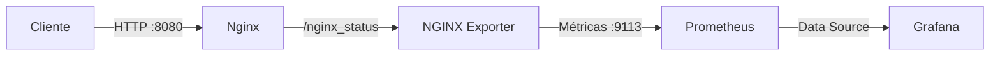

# Monitoramento de Nginx com Prometheus e Grafana

Projeto desenvolvido como teste prático para demonstrar fundamentos de infraestrutura como código, gerenciamento de contêineres, coleta de métricas e automação com Shell Script.

Toda a stack é iniciada com um único comando:

```bash
docker compose up -d --build
```

## Arquitetura



A stack contém:

- **Nginx:** disponibiliza uma página HTML e o endpoint `/nginx_status`.
- **NGINX Prometheus Exporter:** transforma os dados do Nginx em métricas.
- **Prometheus:** coleta as métricas do exporter a cada 5 segundos.
- **Grafana:** apresenta as métricas em um dashboard provisionado automaticamente.
- **Shell Script:** verifica a execução e a saúde dos contêineres, gera tráfego e valida os endpoints da stack.

## Tecnologias utilizadas

- Docker
- Docker Compose
- Nginx
- NGINX Prometheus Exporter 1.5.1
- Prometheus 3.13.1
- Grafana 13.1.0
- Bash

## Pré-requisitos

É necessário possuir o Docker e o Docker Compose instalados.

Para verificar:

```bash
docker --version
docker compose version
```

## Estrutura do projeto

```text
BSAtech-DevOps-SRE/
├── docker-compose.yml
├── grafana/
│   ├── dashboards/
│   │   └── nginx-dashboard.json
│   └── provisioning/
│       ├── dashboards/
│       │   └── dashboard.yml
│       └── datasources/
│           └── datasource.yml
├── nginx/
│   ├── default.conf
│   └── html/
│       └── index.html
├── nginx-exporter/
│   └── Dockerfile
├── prometheus/
│   └── prometheus.yml
├── README.md
└── script.sh
```

## Como executar

Clone o repositório:

```bash
git clone https://github.com/SamuelArcanjo/BSAtech-DevOps-SRE.git
```

Acesse a pasta:

```bash
cd BSAtech-DevOps-SRE
```

Construa a imagem personalizada do exporter e inicie todos os serviços:

```bash
docker compose up -d --build
```

Confira o estado dos contêineres:

```bash
docker compose ps
```

Após o período inicial de verificação, os quatro serviços devem aparecer com o estado `healthy`:

- `nginx`
- `nginx-exporter`
- `prometheus`
- `grafana`


## Healthchecks e ordem de inicialização

Todos os serviços possuem verificações de saúde configuradas no Docker Compose:

- **Nginx:** valida a página HTML e o endpoint `/nginx_status`.
- **NGINX Prometheus Exporter:** valida o endpoint `/metrics` e confirma que a métrica `nginx_up` possui valor `1`.
- **Prometheus:** utiliza o comando `promtool check ready` para confirmar que está pronto para receber consultas.
- **Grafana:** valida o endpoint `/api/health`.

As dependências utilizam `condition: service_healthy`. Dessa forma, cada serviço aguarda sua dependência ficar saudável antes de iniciar.

A ordem de inicialização é:

```text
Nginx saudável
→ NGINX Exporter
→ Prometheus
→ Grafana
```

## Endereços dos serviços

| Serviço | Endereço |
|---|---|
| Página do Nginx | http://localhost:8080 |
| Status do Nginx | http://localhost:8080/nginx_status |
| Métricas do exporter | http://localhost:9113/metrics |
| Prometheus | http://localhost:9090 |
| Targets do Prometheus | http://localhost:9090/targets |
| Grafana | http://localhost:3000 |
| Dashboard do Nginx | http://localhost:3000/d/nginx-monitoring |

Credenciais locais do Grafana:

```text
Usuário: admin
Senha: admin
```

## Dashboard do Grafana

O Data Source do Prometheus e o dashboard são provisionados automaticamente durante a inicialização do Grafana. Não é necessário realizar configurações manuais pela interface.

O dashboard possui os seguintes painéis:

1. **Requisições por segundo (RPS)**

   Consulta PromQL utilizada:

   ```promql
   rate(nginx_http_requests_total[1m])
   ```

2. **Status/disponibilidade do Nginx**

   Consulta PromQL utilizada:

   ```promql
   nginx_up
   ```

   O valor `1` representa `UP` e o valor `0` representa `DOWN`.

3. **Conexões ativas do Nginx**

   Consulta PromQL utilizada:

   ```promql
   nginx_connections_active
   ```

   O painel apresenta a quantidade atual de conexões ativas no Nginx.

## Script de automação

O arquivo `script.sh` realiza as seguintes operações:

- Verifica se os quatro contêineres estão em execução.
- Confirma se todos os contêineres estão com o estado `healthy`.
- Envia 10 requisições HTTP GET para o Nginx.
- Confere se cada resposta possui código HTTP 200.
- Valida o endpoint `/nginx_status`.
- Confirma que o exporter expõe a métrica `nginx_up` com valor `1`.
- Valida os endpoints de prontidão do Prometheus e de saúde do Grafana.
- Retorna código de saída `0` em caso de sucesso e `1` em caso de falha.

Para executar:

```bash
chmod +x script.sh
./script.sh
```

Exemplo de resumo esperado:

```text
Contêineres em execução: 4/4
Contêineres saudáveis: 4/4
Requisições HTTP 200: 10/10
Requisições com erro: 0/10
Endpoints validados: 4/4

[OK] Todos os serviços estão funcionando e saudáveis.
```

As requisições feitas pelo script também geram tráfego para o painel de RPS do Grafana.

## Verificação das métricas

Para confirmar que o exporter consegue acessar o Nginx:

```bash
curl -s http://localhost:9113/metrics | grep nginx_up
```

Resultado esperado:

```text
nginx_up 1
```

Para confirmar que o Prometheus está coletando a métrica:

```bash
curl -s "http://localhost:9090/api/v1/query?query=nginx_up"
```

A resposta deve apresentar `"status":"success"` e o valor `"1"`.

## Logs e solução de problemas

Para visualizar os logs de todos os serviços:

```bash
docker compose logs
```

Para acompanhar os logs em tempo real:

```bash
docker compose logs -f
```

Para visualizar os logs de um serviço específico:

```bash
docker compose logs nginx
docker compose logs nginx-exporter
docker compose logs prometheus
docker compose logs grafana
```

## Encerrar a stack

Para parar e remover os contêineres:

```bash
docker compose down
```

Para remover também os volumes com os dados do Prometheus e Grafana:

```bash
docker compose down -v
```

> O uso de `-v` remove os dados armazenados nos volumes do projeto.

## Autor

Samuel Arcanjo